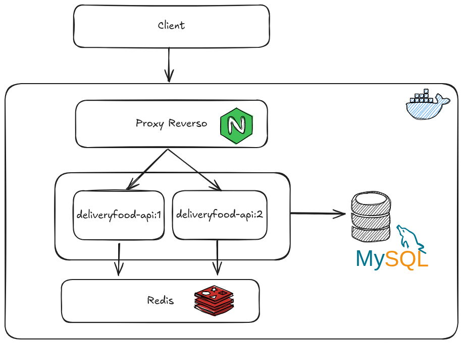
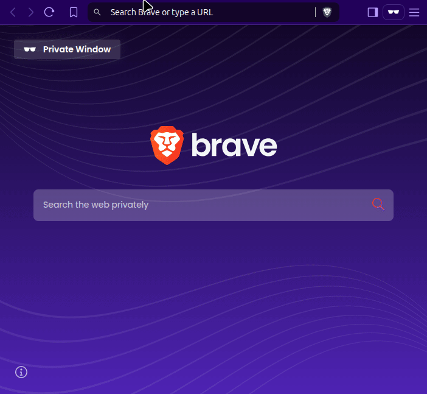
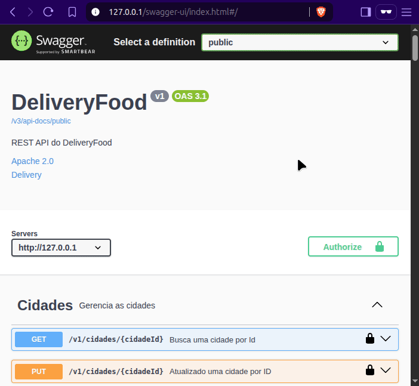

# DELIVERYFOOD-API


---
## Sumário

- [Descrição](#descrição)
- [Objetivo](#objetivo)
- [Modelo de Domínio (DDD)](#modelo-de-domínio-ddd)
- [Principais Tecnologias e Funcionalidades](#principais-tecnologias-e-funcionalidades)
  - [Padrões utilizados](#padrões-utilizados)
  - [Navegação entre recursos](#navegação-entre-recursos)
  - [Autenticação \& Autorização](#autenticação--autorização)
  - [Relatórios](#relatórios)
  - [E-mails](#e-mails)
  - [Cache \& Sessão](#cache--sessão)
  - [Documentação da API](#documentação-da-api)
  - [Banco de Dados](#banco-de-dados)
  - [Versionamento do Banco](#versionamento-do-banco)
  - [JPA (Java Persistence API)](#jpa-java-persistence-api)
  - [Logging](#logging)
  - [Validação de objetos](#validação-de-objetos)
  - [Tratamento de exceções](#tratamento-de-exceções)
- [Docker Compose](#docker-compose)
  - [Arquitetura de Containers](#arquitetura-de-containers)
    - [Componentes](#componentes)
- [Armazenamento de imagem de produtos](#armazenamento-de-imagem-de-produtos)
- [Versão da API](#versão-da-api)
- [Endpoints da API](#endpoints-da-api)
  - [Endpoints Principais](#endpoints-principais)
  - [Autenticação](#autenticação)
  - [Exemplo de Requisição](#exemplo-de-requisição)
- [Swagger UI - Acessando documentação e explorando endpoints](#swagger-ui---acessando-documentação-e-explorando-endpoints)
- [Considerações Finais](#considerações-finais)

## Descrição
API RESTful para um sistema de delivery de comida desenvolvida com:
- Java 17
- Spring Boot 3.4.4
- Arquitetura baseada em Domain-Driven Design (DDD)
- HATEOAS para navegação entre recursos via hipermídia

## Objetivo
- Modelar e Desenvolver um Produto Mínimo Viável (MVP) de API RESTful com Spring Boot.

## Modelo de Domínio (DDD)
- O diagrama foi estruturado utilizando o padrão *Aggregate Root* do *Domain-Driven Design (DDD)*.

<div align="center">
    
    <figcaption>Fonte: <a href="https://assets.algaworks.com/portal/content/especialista-spring-rest/images/diagrama-de-classes-de-dominio.jpg" target="_blank">AlgaWorks</a></figcaption>
</div><br/>

## Principais Tecnologias e Funcionalidades

### Padrões utilizados
- Domain Driven Design (DDD)
  - [*Aggregate Root*](https://martinfowler.com/bliki/DDD_Aggregate.html): utilizado para a modelagem do domínio.
  - [*Repository*](https://martinfowler.com/eaaCatalog/repository.html): utilizado para criar uma camada de abstração entre o domínio e a persistência de dados.
  - *Domain Service* - utilizado para encapsular lógica de negócio que não pertence naturalmente a nenhuma entidade ou objeto de valor, mas que ainda assim é parte integrante do domínio.
  -*Domain Events* - utilizado para disparo automático de envio de e-mail
- Padrão *Arquitetura em Camadas* (Layered Architecture): : organização da aplicação em camadas bem definidas (apresentação, aplicação, domínio e infraestrutura).
- Padrão *MVC* (Model-View-Controller): adaptado ao contexto de API REST, onde:
  - Model representa o domínio da aplicação (entidades e regras de negócio).
  - Controller atua como ponto de entrada das requisições HTTP, orquestrando as chamadas aos serviços e retornando as respostas.
  - View é substituída por DTOs e serialização de dados, que representam as respostas enviadas pela API.
- Padrão *DTO* - utilizado como modelo de representação (representation model) para transferência de dados entre camadas, evitando o acoplamento direto ao modelo de domínio (domain model).

### Navegação entre recursos
- HATEOAS (Hypertext as the Engine of Application State)
- [HAL (Hypertext Application Language)](https://stateless.co/hal_specification.html) - formato usado para escrever representações de recursos de API 

### Autenticação & Autorização
- OAuth2 com JWT (Authorization Code Flow)
- Controle de acesso baseado em roles

### Relatórios
- Geração de PDFs com JasperReports

### E-mails
- Envio de e-mails transacionais com templates Freemarker
- Uso de Domain Events para disparo automático

### Cache & Sessão
- Armazenamento de sessão distribuído com Redis

### Documentação da API
- SpringDoc OpenAPI
- Swagger UI

### Banco de Dados
- MySQL
- Redis

### Versionamento do Banco
- Flyway

### JPA (Java Persistence API)
- Spring Data JPA
- Hibernate

### Logging
- SLF4J
- Logback
- Loggly - serviço de registro de log na nuvem

### Validação de objetos
- Bean Validation

### Tratamento de exceções
- Tratando exceções globais com `@ExceptionHandler` e `@ControllerAdvice`
- Uso da especificação RFC 7807 da IETF para padronizar o formato de resposta com os detalhes do erro. Exemplo:
  ```
  {
  "status": 400,
  "type": "https://deliveryfood.com.br/recurso-em-uso",
  "title": "Recurso em uso",
  "detail": "Nao foi possível excluir a cozinha de código 5, porque ela está em uso”,
  "instance": "/cozinhas/5/erros/43549831"
  }
  ```
  - status -> indica o código de status HTTP gerado pelo servidor da API.
    - Propriedade de conveniência, já que o status está  no cabeçalho da resposta. 
  - type -> URI que identifica o tipo do problema
  - title -> descreve o type, de forma legível para humanos
  - detail -> descrição detalhada do erro específico, legíveis a humanos
  - instance -> (opcional) pode ser infomado uma URI que identifica a ocorrencia exata, específica do erro retornado
  - observação: pode haver mais propriedades, além das padrões, de acordo com a necessidade

## Docker Compose

```bash
# Build e execução com 2 instâncias - troque o número 2 para quantidade de instâncias desejadas
docker compose up --build --scale deliveryfood-api=2
```

### Arquitetura de Containers
<div align="center">
  
</div>

#### Componentes
- Nginx - Proxy reverso (roteamento)
- API (1+ instâncias escaláveis)
- MySQL - Banco de dados principal
- Redis - Cache de sessão distribuído

## Armazenamento de imagem de produtos
- O Armazenamento pode ser feito localmente ou na nuvem, usando a Amazon S3.
- Para definir o tipo de armazenamento, basta definir a variável `local` ou `S3` de ambiente no application.properties. Veja:
  - `deliveryfood.storage.tipo=local` ou `deliveryfood.storage.tipo=S3`

## Versão da API
- A API já está estruturada para suportar versionamento, permitindo a introdução de novas funcionalidades sem impactar versões anteriores.

- **Versão atual:** `v1`

**URL Base:** `http://127.0.0.1/v1`

## Endpoints da API

A API conta com mais de 60 endpoints RESTful. Abaixo estão alguns exemplos representativos. A documentação completa pode ser acessada via Swagger UI: `http://127.0.0.1/swagger-ui/index.html`.

### Endpoints Principais

#### 🏪 Restaurantes
| Operação | Endpoint | Método | Descrição |
|----------|----------|--------|-----------|
| Listar | `/v1/restaurantes` | GET | Lista restaurantes |
| Ativar | `/v1/restaurantes/{restauranteId}/ativo` | PUT | Ativa um restaurante |
| Abrir | `/v1/restaurantes/{restauranteId}/abertura` | PUT | Abre um restaurante |

#### 🍳 Cozinhas
| Operação | Endpoint | Método | Descrição |
|----------|----------|--------|-----------|
| Listar | `/v1/cozinhas` | GET | Lista cozinhas com paginação |
| Cadastrar | `/v1/cozinhas` | POST | Cadastra uma nova cozinha |
| Buscar | `/v1/cozinhas/{cozinhaId}` | GET | Busca cozinha por ID |

#### 🛒 Pedidos
| Operação | Endpoint | Método | Descrição |
|----------|----------|--------|-----------|
| Registrar | `/v1/pedidos` | POST | Cria um novo pedido |
| Buscar | `/v1/pedidos/{codigoPedido}` | GET | Busca pedido por código |
| Confirmar | `/v1/pedidos/{codigoPedido}/confirmacao` | PUT | Confirma um pedido |

#### 💳 Formas de Pagamento
| Operação | Endpoint | Método | Descrição |
|----------|----------|--------|-----------|
| Listar | `/v1/formas-pagamento` | GET | Lista formas de pagamento |
| Associar | `/v1/restaurantes/{restauranteId}/formas-pagamento/{formaPagamentoId}` | PUT | Associa forma de pagamento a restaurante |

#### 👥 Usuários
| Operação | Endpoint | Método | Descrição |
|----------|----------|--------|-----------|
| Cadastrar | `/v1/usuarios` | POST | Cria um novo usuário |
| Alterar Senha | `/v1/usuarios/{usuarioId}/senha` | PUT | Atualiza senha do usuário |
| Associar Grupo | `/v1/usuarios/{usuarioId}/grupos/{grupoId}` | PUT | Associa usuário a grupo |

#### 🏙️ Cidades
| Operação | Endpoint | Método | Descrição |
|----------|----------|--------|-----------|
| Listar | `/v1/cidades` | GET | Lista todas as cidades |
| Cadastrar | `/v1/cidades` | POST | Cadastra uma nova cidade |
| Buscar | `/v1/cidades/{cidadeId}` | GET | Busca cidade por ID |
| Atualizar | `/v1/cidades/{cidadeId}` | PUT | Atualiza uma cidade |

### Autenticação
A API utiliza OAuth2 (Authorization Code Flow). Para autenticar:

1. Obtenha token em `/oauth2/token`
2. Inclua no header: `Authorization: Bearer {token}`

### Exemplo de Requisição
```bash
curl -X GET "http://127.0.0.1/v1/restaurantes" \
  -H "Authorization: Bearer {token}"
```

## Swagger UI - Acessando documentação e explorando endpoints

1. Acesse a UI do Swagger em:  
    - `127.0.0.1/swagger-ui/index.html`
2. Autentique-se com OAuth2
<div align="center">
  
  <br/>
  <sup>Autenticação</sup>
</div>
3. Explore os endpoints disponíveis
<div align="center">
  
  <br/>
  <sup>Autenticação</sup>
</div>

## Considerações Finais
Este projeto foi desenvolvido como parte do curso **Especialista Spring REST** da [AlgaWorks](https://www.algaworks.com/).